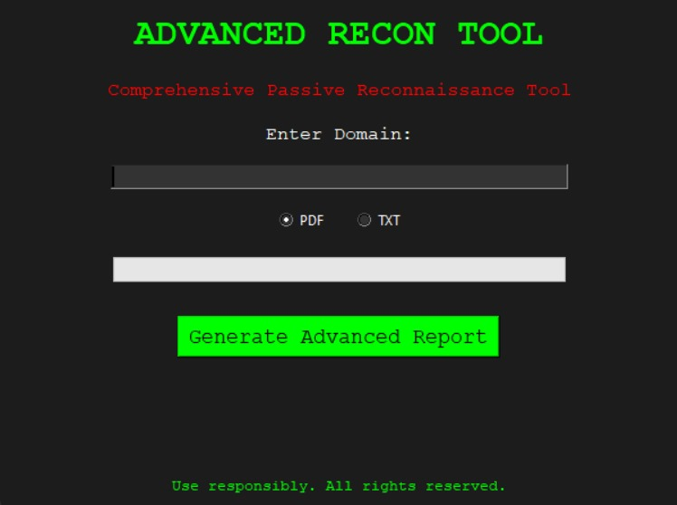

# 🕵️‍♂️ Advanced Passive Reconnaissance Tool

> **A Python-based automated OSINT tool developed during my industrial training at Solara Systems.**

---

## 🧠 Overview

The **Advanced Passive Reconnaissance Tool** automates the collection and analysis of publicly available data about target organizations, such as domain details, subdomains, IP addresses, and more — all without directly interacting with the target.

Built to demonstrate effective and stealthy OSINT techniques.

## 📸 Screenshots

### 🖥 Homepage Screenshot

<p align="center">
  
</p>

---

## 🔑 Key Features

1. **Automated Data Gathering**
   - Domain name, WHOIS, subdomains, emails, IP info

2. **Tool Integration**
   - Combines output from: `whois`, `nslookup`, `Shodan`, `sublist3r`, and `Google Dorking`

3. **Passive Analysis**
   - No active probing — completely stealthy and legal information gathering

---

## ⚙️ Tools & Technologies Used

- **Language**: Python 3
- **Libraries**: `requests`, `os`, `shodan`, `socket`, `re`, etc.
- **IDEs**: Visual Studio Code
- **External Tools**: Sublist3r, Whois, Nslookup

---

## 🚀 How to Run

```bash
git clone https://github.com/abby-exe/advanced-passive-recon-tool.git
cd advanced-passive-recon-tool
python3 domain_info3.py
